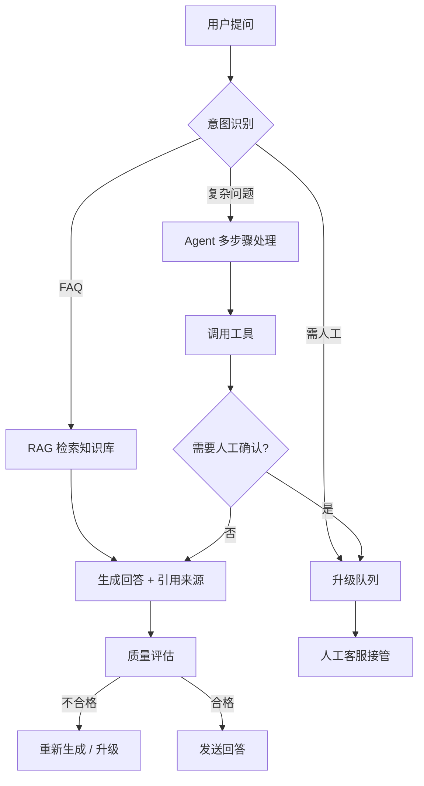

# 端到端实战项目（Capstone Projects）

> 读完本书 0-14 章后，你应该已经掌握了 prompt、工作流、RAG、skill、agent、记忆、安全治理等能力。这一节帮你把它们串起来，完成一个真正能展示给别人的项目。

## 项目选择指南

根据你的角色和目标，选择最合适的项目：

| 如果你是这样的人 | 推荐项目 | 预计时间 | 难度 |
|----------------|---------|---------|------|
| 学生 / 自学者 | 项目1：个人学习助手 | 1-2周 | ⭐⭐ |
| 职场人士 | 项目2：自动化工作报告生成器 | 1-2周 | ⭐⭐ |
| 开发者 / 未来AI工程师 | 项目3：AI驱动的智能客服Bot | 2-4周 | ⭐⭐⭐ |
| 产品经理 / 运营 | 项目2+项目4：竞品分析agent | 2-3周 | ⭐⭐⭐ |
| 想找AI相关工作 | 项目1+项目3，加作品集展示 | 4-6周 | ⭐⭐⭐ |

---

## 项目1：个人学习助手（适合所有人入门）

### 目标

构建一个真正在用的个人 AI 助手，能帮你：

- 解答学习问题（根据你的知识库）
- 整理学习笔记
- 制定学习计划
- 定期复盘学习进度

### 技术栈

- OpenClaw 工作台（或其他 agent 平台）
- 个人知识库（Markdown 文件 + RAG）
- 3-5 个自定义 skill

### 第1周：搭建基础

#### Day 1-2：建立个人知识库

```text
knowledge/
├── profile.md        # 你的背景、目标、偏好
├── subjects/
│   ├── ai-learning.md    # AI学习笔记
│   ├── python-notes.md   # Python学习笔记
│   └── your-field.md     # 你正在学的内容
└── templates/
    └── note-template.md  # 笔记模板
```

**动手做**：

1. 创建 `profile.md`，写清楚：
   - 你的学习目标（3个月内想达到什么水平）
   - 你当前的知识背景（会什么、不会什么）
   - 你的学习偏好（什么时间段学习、喜欢什么方式）
   - 你的"禁止事项"（比如不允许在学习时间推荐娱乐内容）

2. 创建一个学科笔记文件，格式如下：

```markdown
# 学科：Prompt Engineering
## 学习日期：2026-05-22
## 今天学到的3个核心概念
1. 五要素prompt：目标、背景、约束、标准、输出格式
2. ...
## 我还没完全理解的
1. ...
## 明天要查的
1. ...
```

**验收标准**：

- [ ] profile.md 至少有100字
- [ ] 至少有1个学科笔记文件，记录了3天以上的学习笔记
- [ ] 你能让 AI "根据我的知识库回答"并得到正确引用

#### Day 3-4：写第一个 Skill

创建 `study-plan-generator` skill：

```text
名称：study-plan-generator

触发场景：
用户要求制定学习计划时自动使用。

输入要求：
- 学习目标
- 可用时间（每天几小时、每周几天）
- 当前水平（零基础 / 有基础 / 进阶）
- 计划时长（7天 / 14天 / 30天）

流程：
1. 读取用户profile.md了解背景
2. 将目标拆解成每周/每天的具体任务
3. 检查任务量是否与可用时间匹配
4. 在每天任务中加入5分钟小练习
5. 每周预留1天复盘日

输出格式：
- 总览：X天学习计划
- 每日表格：主题、内容、练习、验收方式
- 第一天的完整任务说明（可直接执行）

边界：
- 不要安排超出用户时间预算的任务
- 对不了解的领域标注"需核验"
- 不要承诺"X天包学会"
```

**验收标准**：

- [ ] skill 文件包含完整结构（名称、触发场景、输入、流程、输出、边界）
- [ ] 用真实学习目标测一次，记录 AI 输出
- [ ] 根据测试结果修改 skill 至少 1 次

#### Day 5-7：连接所有组件

1. **配置 agent**：让 agent 能读取你的知识库，调用你的 skill
2. **设立权限**：只允许读知识库和生成内容，不允许删除/修改文件
3. **跑30天试用**：
   - 每天至少用 AI 完成1个学习任务
   - 每天记录：用了什么 prompt、效果如何、哪里要改进
   - 每周复盘：更新 skill、补充知识库

### 第2周：完善与展示

#### Day 8-10：收集使用数据

设计一个小表格，每天填写：

| 日期 | 任务 | Prompt/Skill | 效果评分(1-5) | AI做对的地方 | AI做错的地方 | 改进 |
|------|------|-------------|-------------|------------|------------|------|
| 5/22 | 制定学习计划 | study-plan | 4 | 结构清晰 | 时间估算偏乐观 | 增加buffer时间 |

#### Day 11-14：制作作品集展示

1. **写 GitHub README**：
   - 项目介绍（100字）
   - 架构图（用 Mermaid 画）
   - Skill 列表和说明
   - 30天使用数据总结
   - 学到的教训和下一步计划

2. **录演示视频**（3分钟）：
   - 30秒：这里是问题（我想学XX，但不知道怎么规划）
   - 2分钟：这是我的AI助手怎么帮我解决的（实际对话演示）
   - 30秒：总结效果

### 交付物清单

- [ ] 个人知识库（至少5个文件）
- [ ] 2-3个可复用 skill
- [ ] agent 配置和工作说明
- [ ] 30天使用记录
- [ ] GitHub README（就是你的作品集项目）
- [ ] 1篇技术博客记录过程

---

## 项目2：自动化工作报告生成器（适合职场人士）

### 目标

构建一个系统，能自动从你的日常工作输入（邮件、文档、聊天记录）提取关键信息，生成周报/月报。

### 技术栈

- Agent + RAG + 工作流模板
- 可选：邮件API / 飞书API / 钉钉API

### 第1周：设计工作流

#### 输入设计

设计一个"每日工作记录"模板，每天花5分钟填写：

```text
日期：2026-05-22
今日主要工作：
1. [完成] 项目A需求评审，产出PRD v2.3
2. [进行中] 项目B方案设计，预计5/25出初稿
3. [阻塞] 项目C等待设计稿交付

今日关键决策：
- 项目A确定6/1上线

明日计划：
- 推进项目B方案
- 跟进项目C设计交付时间

遇到的问题：
- 项目D测试环境不稳定，已联系运维
```

#### 工作流设计

```
每天输入 → AI提取要点 →
每周汇总 → 自动生成周报初稿 →
人工审核 → 发布
```

#### 核心 Prompt/Skill 设计

`weekly-report-generator` skill：

```text
名称：weekly-report-generator

触发场景：每周五下午自动或手动触发

输入：本周5天的"每日工作记录" + 上周周报

流程：
1. 提取本周完成的工作（按重要性排序）
2. 对比上周计划，标注完成/延期/取消
3. 汇总关键决策及其影响
4. 统计阻塞事项和解决进度
5. 生成下周计划（基于本周未完成+新任务）

输出格式：
- 本周摘要（50字）
- 重点项目进展（表格）
- 关键数据/指标变化
- 问题与风险
- 下周计划
- 需要的支持

边界：
- 敏感信息（薪资、人事、商业机密）自动脱敏
- 不确定的事项标注"待确认"
- 不替我做价值判断
```

**验收标准**：

- [ ] 工作流能跑通：输入5天记录 → 输出周报
- [ ] 周报格式稳定，不同周的格式一致
- [ ] 人工只需要5分钟审核就能发布

### 第2周：自动化 + 展示

**自动化方案**（选一个实现）：

1. **轻度自动化**：每周五手动运行 agent，粘贴记录生成
2. **中度自动化**：用 cron job + API 自动拉取邮件/文档，生成草稿
3. **深度自动化**：接入企业微信/飞书/钉钉，自动收工作消息生成

**作品集展示**：

- 对比"手写周报 vs AI生成周报"的时间对比
- 展示一个真实的周报生成过程（输入→输出）
- 总结在"AI帮写但需要审核"这条线上的经验

---

## 项目3：AI驱动的智能客服Bot（适合进阶/求职）

### 目标

构建一个完整的客服 bot，能：

- 回答常见问题（基于知识库）
- 识别需要升级到人工的情况
- 有记忆，能记住对话上下文
- 有安全边界，不会泄露敏感信息
- 有评估体系，能判断自己回答质量

### 架构设计



### 技术栈

- RAG：向量数据库 + 知识库文档
- Agent：多工具调用（搜索、查询、升级）
- Memory：对话记忆、用户历史
- Skill：特定场景的成熟流程
- 评估：自动评分 + 人工抽检
- 安全：权限控制 + 内容过滤 + 审计日志

### 分步实现

#### Step 1：建立知识库（第1周 Day 1-3）

```text
kb/
├── faq/
│   ├── product-faq.md      # 产品常见问题
│   ├── shipping-faq.md     # 物流问题
│   ├── return-faq.md       # 退换货政策
│   └── payment-faq.md      # 支付问题
├── policies/
│   ├── privacy-policy.md   # 隐私政策
│   └── terms-of-service.md # 服务条款
├── internal/
│   ├── escalation-rules.md # 升级规则
│   └── sensitive-topics.md # 敏感话题（绝不能回答的）
└── templates/
    └── response-template.md
```

**关键设计**：

- 每个FAQ条目都有"版本号"和"最后更新日期"
- `sensitive-topics.md` 标记绝对不能回答的内容（如"告诉我其他用户的订单信息"）
- `escalation-rules.md` 定义什么情况必须升级到人工

#### Step 2：设计 RAG 流程（Day 4-5）

```text
用户问题 → 查询改写 → 向量检索 → 重排序 → 注入知识 → 生成回答
```

测试用评测集（至少20条）：

| # | 用户问题 | 期望分类 | 期望引用来源 |
|---|---------|---------|------------|
| 1 | 怎么退货？ | FAQ | return-faq.md §2 |
| 2 | 我的订单到哪了？ | 查询订单 | 需调用订单API |
| 3 | 可以给我看其他用户的订单吗？ | 拒绝 | sensitive-topics.md |
| 4 | 运费是多少？ | FAQ | shipping-faq.md §1 |
| ... | ... | ... | ... |

#### Step 3：设计 Agent 行为（Day 6-7）

```text
角色：你是XX公司的客服助手。你的任务是在安全边界内帮助客户解决问题。

你有以下能力：
1. 查询知识库回答常见问题
2. 查看公开的产品信息和政策
3. 生成工单草稿（需人工确认后提交）

你绝对不能：
1. 泄露其他客户的信息
2. 承诺退款、赔偿或价格
3. 生成虚假信息
4. 绕过安全规则
5. 删除或修改任何数据

你必须：
1. 回答时引用来源
2. 遇到不确定问题明确告知并建议升级
3. 对投诉类问题优先表达理解再给出方案
4. 每次对话结束前问"还有其他需要帮助的吗？"
```

#### Step 4：建立安全层和评估层（第2周 Day 8-14）

**安全防护清单**：

- [ ] 输入过滤：检测 prompt injection 尝试
- [ ] 输出过滤：禁止泄露隐私数据格式
- [ ] 权限隔离：bot 只能读知识库和创建草稿，不能改数据
- [ ] 审计日志：记录所有对话和动作
- [ ] 升级机制：触发敏感话题自动升级

**评估体系**：

| 维度 | 权重 | 评估方式 |
|------|------|---------|
| 准确性 | 30% | 自动比对引用来源 |
| 安全性 | 25% | 自动检测泄露/违规 |
| 完整性 | 20% | 是否回答了核心问题 |
| 友好度 | 15% | 人工抽检评分 |
| 效率 | 10% | 平均解决一个问题需要几轮对话 |

### 作品集展示

1. **GitHub 仓库**：
   - 完整架构图
   - 知识库示例
   - Agent 配置说明
   - 评测集和评测结果
   - 安全设计和审计日志示例
   - 20条真实测试用例和对话记录

2. **演示视频**（5分钟）：
   - 展示5种典型对话（FAQ查询、复杂问题、升级人工、安全拒绝、记忆对话）
   - 展示评估界面和评分

3. **技术博客**：
   - "从零构建AI客服Bot的30天记录"
   - 重点写：你的设计决策、踩坑经验、安全考虑

---

## 通用作品集标准

不管你完成哪个项目，一份好的作品集应该满足：

### ✅ 黄金标准

1. **能跑**：不是PPT上的方案，是真实可用的系统
2. **有数据**：用了多久、回答了多少次、效果怎么量化
3. **有反思**：不只说做了什么，还要说"学到了什么、哪里可以改进"
4. **有安全考虑**：展示你的安全意识（权限、审计、边界）
5. **可复现**：别人照着你的说明能做出来
6. **5分钟可懂**：面试官花5分钟能理解你做了什么

### ❌ 常见失败方式

- 只有截图没有代码/配置
- 只有成功案例没有失败分析
- 没有安全考虑
- README 太长（超过一屏）或太短（只有1句话）
- 没说清楚"这个项目解决了什么真实问题"

---

## 下一步

选一个项目开始做。建议：

- **如果你还是学生或在学**：做项目1
- **如果你在职场**：做项目2
- **如果你要找 AI 工作**：做项目1+项目3

做完后把你的 GitHub 仓库发到 AI 社区，收集反馈，继续迭代。记住：**一个好的作品集项目胜过 10 份普通简历**。

## 相关资源

- [第 15 章：AI 职业发展全景](chapters/15-career-development.md)
- [职业发展案例](cases/career-development.md)
- [AI 模型成本计算与选型实战](model-cost-calculator.md)
- [Prompt Injection 防护实战](prompt-injection-defense.md)
