# 图解：AI 工作系统

这些图用 Mermaid 描述。GitHub 仓库页面通常可以直接渲染 Mermaid；如果在 GitHub Pages 上没有渲染，也可以把代码复制到 Mermaid Live Editor 或支持 Mermaid 的 Markdown 工具中查看。

## 从对话到 Agent

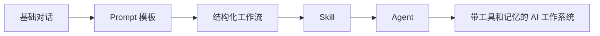

理解方式：

- 基础对话解决“说清楚”。
- Prompt 模板解决“重复问得稳定”。
- 工作流解决“复杂任务分步骤”。
- Skill 解决“把经验固化”。
- Agent 解决“在边界内行动”。

## 好 Prompt 的结构

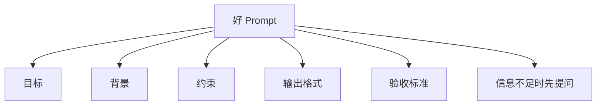

## RAG 基本流程

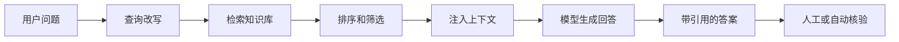

关键检查点：

- 检索是否找到正确资料。
- 上下文是否足够完整。
- 回答是否标注来源。
- 知识库资料是否过时。

## RAG 从一次问答升级到可复用能力

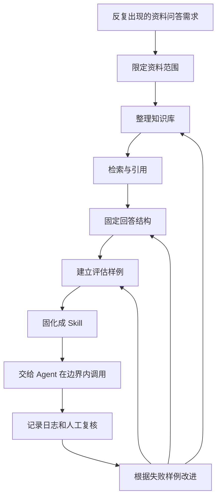

理解方式：

- RAG 先解决“回答要基于资料”。
- 评估解决“回答是否真的可用”。
- Skill 解决“下次仍按同一套流程做”。
- Agent 解决“在权限边界内自动调用检索、工具和模板”。
- 日志和复核解决“出了问题能追溯、能改进”。

## RAG、Skill、Agent、Memory 的分工

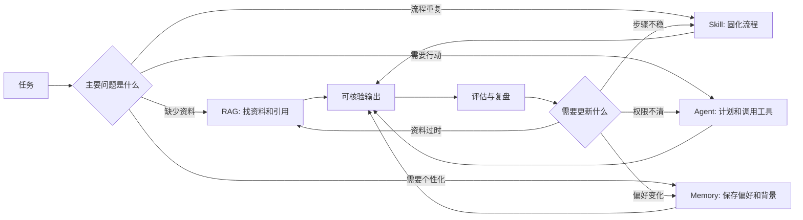

这四个概念不应该互相替代。一个团队知识库场景通常先从 RAG 做起，稳定后沉淀成 skill；只有当任务需要跨工具行动时，才引入 agent；只有确实需要跨会话保存偏好和背景时，才引入 memory。

## Agent 基本循环

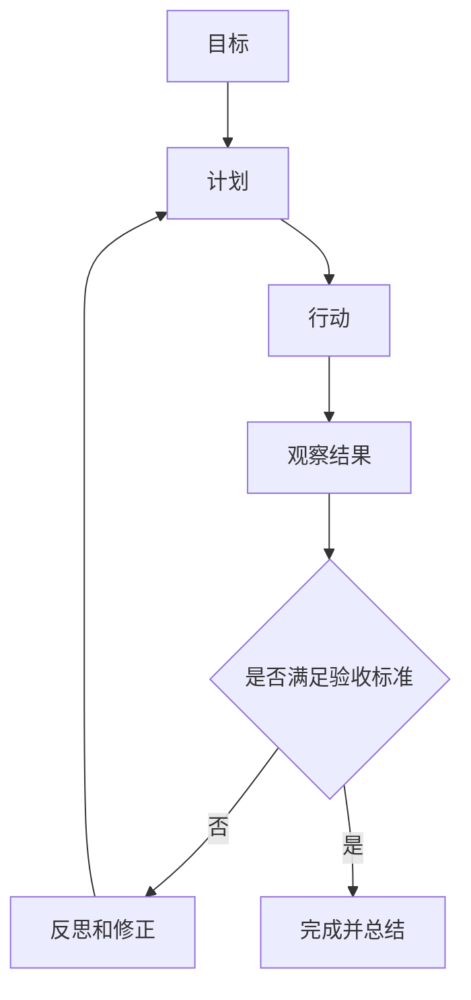

Agent 的关键不是“自动做更多事”，而是每一步都能被观察、限制和验证。

## Agent 权限分层

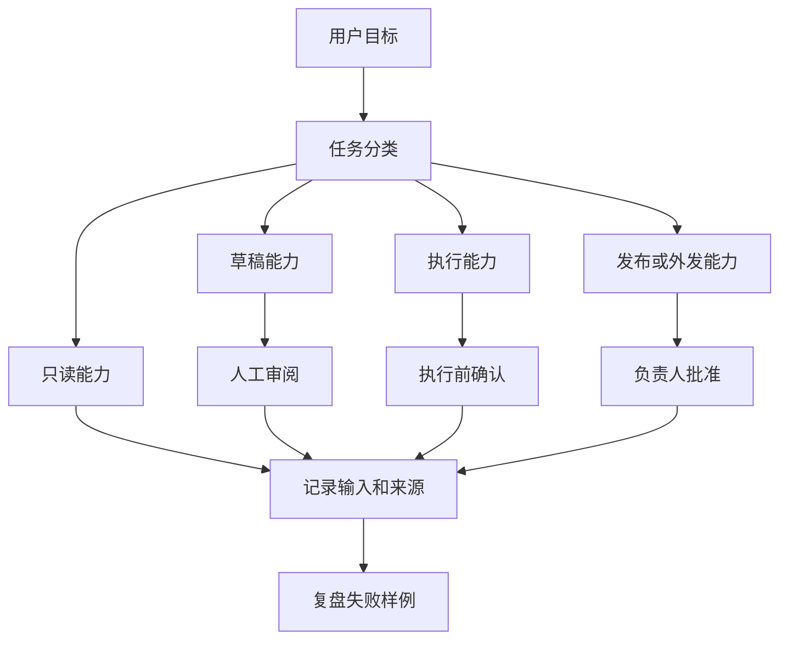

设计 agent 时，先把能力分层，而不是先追求“全自动”。读资料、写草稿、执行动作、发布外发的风险不同，应该对应不同的确认和审计要求。

## Skill 的组成

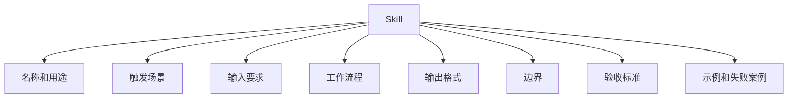

## 记忆系统

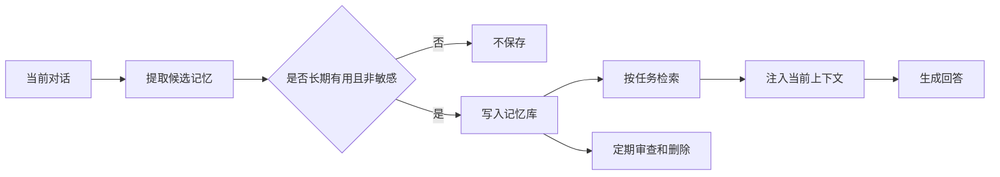

记忆不是越多越好。好的记忆系统必须能写入、检索、更新和遗忘。

## 记忆写入决策

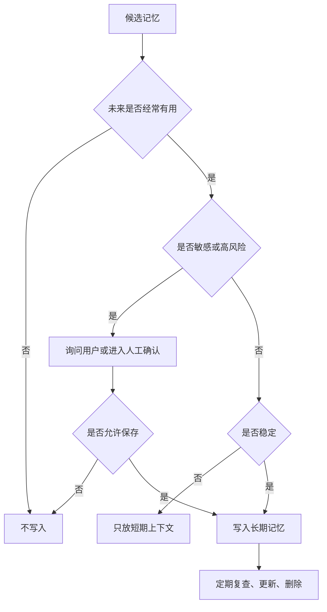

适合保存的记忆通常是稳定偏好、项目背景和长期目标。不适合默认保存的是身份证件、医疗细节、临时情绪、一次性密码、未确认的推断和可能伤害用户的标签。

## 权限与治理

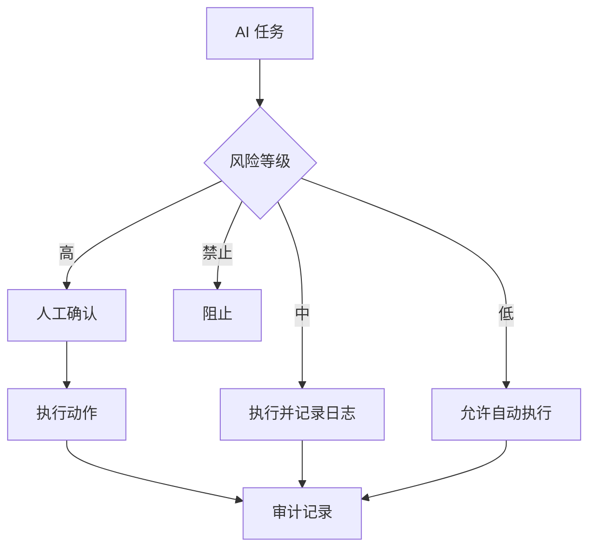

高风险动作包括删除文件、发送邮件、付款、发布内容、改变权限、处理敏感数据。

## 个人 AI 学习系统

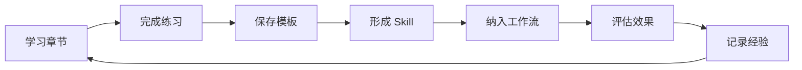

这本书的目标不是让你读完所有概念，而是让你建立一个会持续改进的个人 AI 使用系统。
