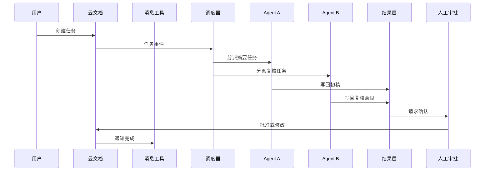

# OpenClaw 多 Agent 联动教程

这篇不是一句“多个 agent 可以联动”的口号，而是一套可以真的落地的协同设计。它的目标很简单：让多个 OpenClaw / CLI / Web agent 通过统一任务源、统一技能包和统一回写层协作，同时保留人工确认和审计。

如果你只记一句话，可以记成：

```text
云文档管任务，消息管通知，技能管能力，agent 管执行，人管审批。
```

## 适合什么场景

- 读书会或研究组里的分工协作。
- 团队试点中的任务分发。
- 多个 agent 共同处理资料、摘要、代码、表格和复盘。
- 需要把结果统一写回知识库或云文档的流程。

## 不适合什么场景

- 高风险自动发布。
- 需要强实时、强一致事务的财务级流程。
- 没有人工责任人的场景。
- 还没定义权限边界的场景。

## 五种联动方式

| 方式 | 核心思路 | 优点 | 缺点 | 适用场景 |
| --- | --- | --- | --- | --- |
| 云文档中心式 | 所有任务先写入共享文档，agent 再认领 | 透明、易审阅、适合人看 | 并发控制弱，容易冲突 | 读书会、试点、复盘 |
| 消息总线式 | 飞书、Telegram、Slack 等只负责通知和分发 | 响应快，适合移动端 | 状态容易丢，历史难查 | 轻量协作、临时任务 |
| 看板状态式 | 任务存在项目看板里，agent 按状态流转 | 状态清楚，适合团队 | 配置较重，流程复杂 | 团队试点、重复任务 |
| 仓库事件式 | 任务和结果都写回 Git/Markdown/Issue | 审计强，差异清楚 | 不够实时，适合文档型任务 | 知识整理、工程协作 |
| 编排器中心式 | 由一个调度器统一分派 agent | 控制最强，扩展性好 | 需要额外服务 | 复杂多 agent 系统 |

## 推荐做法

最稳妥的不是单点，而是混合式：

```text
云文档 = 任务源
消息工具 = 通知层
状态表 = 进度层
OpenClaw / CLI agents = 执行层
知识库 / Git = 结果层
人工审批 = 闸门
```

### 为什么这样最好

- 云文档适合人协作，也适合做任务总表。
- 消息工具适合推送和提醒，但不适合做唯一真相源。
- 状态表适合追踪每个任务的 owner、状态和版本。
- 结果层需要留痕，便于复盘和回滚。

## 一个推荐的数据结构

可以把每个任务写成一段标准化 front matter：

```yaml
task_id: task-20260517-001
title: 整理第 12 章读后问题
owner: agent-a
status: open
priority: high
skill_pack: chapter-review
source_doc: feishu://book/notes/12
output_doc: feishu://book/results/12-summary
approval: required
budget:
  tokens: 12000
  minutes: 20
```

这样做的好处是：

- 任务可搜索。
- 任务可排序。
- 任务可追踪。
- 任务可迁移。

## 统一技能安装

如果你想把“安装一个技能包”变成可复制流程，建议做成下面的结构：

```text
skill/
  manifest.yaml
  readme.md
  prompts/
  tests/
  examples/
  policy.md
```

### 安装时要做什么

1. 读取 manifest。
2. 校验版本和依赖。
3. 校验权限和禁止事项。
4. 安装到统一注册表。
5. 把可用技能广播给 agent。
6. 记录安装日志。

### 为什么这比“复制一个 prompt 文件”强

- 统一版本管理。
- 统一测试样例。
- 统一权限清单。
- 统一回滚机制。

## 工作流示例



## 关键控制点

### 1. 任务认领

- 每个任务必须有唯一 `task_id`。
- 每个任务只能有一个当前 owner。
- 超时要能释放。

### 2. 幂等性

- 重复收到同一个任务事件时，不能重复执行。
- 回写前要检查版本号。

### 3. 权限分层

- 读权限和写权限分开。
- 能看文档，不等于能改文档。
- 能改草稿，不等于能发正式内容。

### 4. 人工闸门

- 涉及对外发布、预算、删除、账号、隐私时，必须人工确认。
- 低风险任务可以自动执行，但要保留日志。

## 常见失败模式

| 失败模式 | 表现 | 修复方式 |
| --- | --- | --- |
| 多个 agent 同时抢同一任务 | 输出重复、互相覆盖 | 任务锁 + 版本号 |
| 结果写回不一致 | 文档里前后冲突 | 单一结果源 + 审批 |
| 消息只通知不落地 | 群里热闹，文档为空 | 强制回写状态 |
| 技能包混乱 | 不同 agent 用不同版本 | 统一注册表 + 版本号 |
| 没有退出条件 | 任务一直挂起 | 超时、失败和回退规则 |

## 最适合你的落地路径

如果你现在就要做，建议从最小闭环开始：

1. 只选 2 到 3 个 agent。
2. 只选一个云文档或一个任务看板作为任务源。
3. 只选一个消息工具负责通知。
4. 只选一个技能包做试点。
5. 先处理低风险任务。

这样能把“多 agent 联动”从概念变成稳定流程。

## 这套设计的优势

- 对人透明。
- 对机器可执行。
- 对团队可审计。
- 对迭代可复用。

## 这套设计的短板

- 比单机脚本复杂。
- 需要一个最小编排层。
- 需要明确权限和版本。
- 需要人工责任人。

## 练习

把你的一个真实协作任务写成标准任务卡：

```text
任务名称：
任务源：
通知工具：
执行 agent：
输出位置：
人工确认点：
回滚方式：
```

如果你能把这个卡写清楚，说明你已经不只是“想让多个 agent 一起跑”，而是在设计一个可运营的协作系统。
