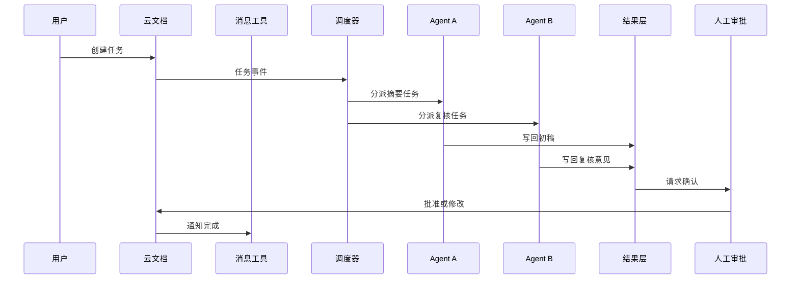

# OpenClaw 多 Agent 联动教程

这篇不是一句“多个 agent 可以联动”的口号，而是一套可以真的落地的协同设计。它的目标很简单：让多个 OpenClaw / CLI / Web agent 通过统一任务源、统一技能包和统一回写层协作，同时保留人工确认和审计。

如果你只记一句话，可以记成：

```text
云文档管任务，消息管通知，技能管能力，agent 管执行，人管审批。
```

## 适合什么场景

- 读书会或研究组里的分工协作。
- 团队试点中的任务分发。
- 多个 agent 共同处理资料、摘要、代码、表格和复盘。
- 需要把结果统一写回知识库或云文档的流程。

## 不适合什么场景

- 高风险自动发布。
- 需要强实时、强一致事务的财务级流程。
- 没有人工责任人的场景。
- 还没定义权限边界的场景。

## 五种联动方式

| 方式 | 核心思路 | 优点 | 缺点 | 适用场景 |
| --- | --- | --- | --- | --- |
| 云文档中心式 | 所有任务先写入共享文档，agent 再认领 | 透明、易审阅、适合人看 | 并发控制弱，容易冲突 | 读书会、试点、复盘 |
| 消息总线式 | 飞书、Telegram、Slack 等只负责通知和分发 | 响应快，适合移动端 | 状态容易丢，历史难查 | 轻量协作、临时任务 |
| 看板状态式 | 任务存在项目看板里，agent 按状态流转 | 状态清楚，适合团队 | 配置较重，流程复杂 | 团队试点、重复任务 |
| 仓库事件式 | 任务和结果都写回 Git/Markdown/Issue | 审计强，差异清楚 | 不够实时，适合文档型任务 | 知识整理、工程协作 |
| 编排器中心式 | 由一个调度器统一分派 agent | 控制最强，扩展性好 | 需要额外服务 | 复杂多 agent 系统 |

这五种方式不是互斥关系。真正稳定的方案往往是混合式：用云文档给人看，用消息工具提醒，用看板管状态，用 Git 留痕，用编排器保证任务不会被重复执行。

## 三种部署层级

| 层级 | 做法 | 优点 | 风险 | 适合谁 |
| --- | --- | --- | --- | --- |
| 轻量版 | 云文档 + 群消息 + 手动触发 agent | 最容易开始，不需要服务端 | 人工步骤多，容易忘记回写 | 个人、读书会、早期试点 |
| 半自动版 | 云文档 + Telegram/飞书 bot + 本地编排器 | 任务可自动分发，成本低 | 本地机器离线会中断 | 小团队、内容项目、学习项目 |
| 服务版 | 云文档/看板 + 消息总线 + 常驻编排服务 + 权限中心 | 稳定、可审计、可扩展 | 架构复杂，需要维护 | 长期团队、企业内训、研发协作 |

建议从轻量版开始，不要一上来就做服务版。多 agent 系统最难的不是把 agent 叫起来，而是把任务、状态、权限、回写和复盘统一起来。

## 推荐做法

最稳妥的不是单点，而是混合式：

```text
云文档 = 任务源
消息工具 = 通知层
状态表 / 黑板 = 进度层和共享工作台
OpenClaw / CLI agents = 执行层
知识库 / Git = 结果层
人工审批 = 闸门
```

### 为什么这样最好

- 云文档适合人协作，也适合做任务总表。
- 消息工具适合推送和提醒，但不适合做唯一真相源。
- 状态表或黑板适合追踪每个任务的 owner、状态、版本、证据、假设和决策。
- 结果层需要留痕，便于复盘和回滚。

## 增加一层共享黑板

多 agent 联动真正难的地方，不是让多个 agent 都启动，而是让它们围绕同一个工作现场行动。这里可以借用 [Blackboard Architecture：黑板架构与多 agent 协作](blackboard-architecture-multi-agent.md) 的思想：所有 agent 不靠群聊互相猜，而是围绕一个共享黑板读写任务、证据、上下文、假设、状态和决策。

在 OpenClaw 联动里，黑板可以由几种工具共同承担：

| 黑板区域 | 可用载体 | 存什么 | 谁主要写 |
| --- | --- | --- | --- |
| 任务区 | 飞书多维表格、GitHub Issue、Markdown task file | 任务目标、owner、状态、优先级、锁 | 人、调度 agent |
| 证据区 | 云文档、Git、知识库 | 来源、摘要、引用、待核验点 | 资料 agent |
| 上下文区 | YAML、Markdown front matter、SQLite | 当前 agent 应该看到的规则、资料和限制 | 调度 agent |
| 草稿区 | Markdown、云文档、分支 PR | 正文、代码、表格、报告草稿 | 写作/执行 agent |
| 复核区 | 评论、检查日志、CI artifact | 断链、术语、事实边界、安全风险 | 复核 agent |
| 决策区 | 审批表、commit message、release note | 人工批准、拒绝原因、发布记录 | 人、发布 agent |

黑板不是让每个 agent 看到所有东西。更好的做法是：黑板保存全量状态，[Context Engineering：上下文工程](context-engineering.md) 从黑板里为当前 agent 生成最小可用上下文包。

一个任务在黑板中的结构可以这样写：

```yaml
blackboard_id: bb-20260519-openclaw-001
task:
  id: task-20260519-001
  title: 扩充第 10 章 OpenClaw 教程
  status: drafting
  owner: writer-agent
  priority: high
context_package:
  goal: 增加飞书、Telegram、云文档、OpenClaw 的多 agent 联动案例
  must_include:
    - 任务状态机
    - 人工审批点
    - 统一 skill 安装
    - 上下文包和黑板层
  must_avoid:
    - 绕过平台授权
    - 自动注册账号
    - 未经确认的外部事实
evidence:
  accepted:
    - 云文档适合作为人类可见任务源
    - Telegram 更适合通知，不适合作为唯一事实源
  pending:
    - 真实飞书 API 字段需要后续按官方文档复核
hypotheses:
  - Markdown 适合审计，但高频状态流转需要 SQLite 或事件流
locks:
  current_owner: writer-agent
  expires_at: 2026-05-19T18:00:00+08:00
review:
  human_gate:
    - 对外发布
    - 删除内容
    - 写入凭据
    - 触发付费调用
outputs:
  files:
    - docs/openclaw-multi-agent-linkage.md
```

这比单纯任务卡更强，因为它记录的不只是“谁做什么”，还记录“这次行动应该看什么、不能看什么、依据是什么、谁批准发布”。

## 用事件流回放协作过程

如果你的任务需要复盘、审计或排错，可以再加一层 [Event Sourcing：事件溯源与任务回放](event-sourcing.md)。做法不是每次覆盖状态，而是把关键变化追加成事件。

当事件越来越多时，不要让每个 agent 都从头读取事件流。可以用 [CQRS：读写分离与多 agent 查询视图](cqrs.md) 和 [Read Model 与 Projection：读模型与投影](read-model-projections.md)，把事件流持续转换成 `tasks_current`、`agent_workload`、`risk_queue` 这类读模型，让人和 agent 快速查询当前状态。

如果任务还要可靠通知别的系统或避免重复投递，可以再加一层 [Transactional Outbox 与幂等消费](transactional-outbox-idempotency.md)。

如果任务跨多个审批人、多个发布步骤或多个外部系统，还可以再加一层 [Saga：补偿事务与流程编排](saga-process-manager.md)，把长流程状态机显式写出来，失败时按补偿动作收尾。

如果任务会运行很久、等待人工批准或跨重启继续，则可以继续引入 [Durable Execution：持久化执行与 agent 长任务](durable-execution-agent-workflows.md)，让长流程状态不依赖某个一次性脚本进程。

常见事件可以是：

- `task_created`
- `task_claimed`
- `evidence_added`
- `context_pack_generated`
- `draft_written`
- `review_blocked`
- `approved`
- `published`
- `rolled_back`

这样一来，黑板负责“现在”，事件流负责“过去”。回头看任务时，你既能看到当前状态，也能看到协作路径。

## 一个推荐的数据结构

可以把每个任务写成一段标准化 front matter：

```yaml
task_id: task-20260517-001
title: 整理第 12 章读后问题
owner: agent-a
status: open
priority: high
skill_pack: chapter-review
source_doc: feishu://book/notes/12
output_doc: feishu://book/results/12-summary
approval: required
budget:
  tokens: 12000
  minutes: 20
```

这样做的好处是：

- 任务可搜索。
- 任务可排序。
- 任务可追踪。
- 任务可迁移。

## 统一技能安装

如果你想把“安装一个技能包”变成可复制流程，建议做成下面的结构：

```text
skill/
  manifest.yaml
  readme.md
  prompts/
  tests/
  examples/
  policy.md
```

### 安装时要做什么

1. 读取 manifest。
2. 校验版本和依赖。
3. 校验权限和禁止事项。
4. 安装到统一注册表。
5. 把可用技能广播给 agent。
6. 记录安装日志。

### 为什么这比“复制一个 prompt 文件”强

- 统一版本管理。
- 统一测试样例。
- 统一权限清单。
- 统一回滚机制。

## 完整案例：飞书 + Telegram + 云文档 + OpenClaw

假设你要做一个“AI 书稿自动维护小组”，目标是让多个 agent 协作扩充一本书，同时避免乱改、漏改和无法追踪。

### 角色设计

| 角色 | 负责什么 | 能做什么 | 不能做什么 |
| --- | --- | --- | --- |
| 任务调度 agent | 读取云文档任务表，分派任务 | 创建任务、改状态、提醒 owner | 不能直接发布 |
| 资料研究 agent | 找资料、提炼证据、标记不确定点 | 写资料摘要和来源清单 | 不能改最终书稿 |
| 写作 agent | 根据任务卡扩写章节 | 写草稿、补案例、补结构 | 不能绕过复核 |
| 复核 agent | 检查术语、链接、逻辑和安全边界 | 提出修改意见、打风险标签 | 不能替人批准高风险内容 |
| 发布 agent | 执行检查、提交、推送 | 跑测试、提交、触发发布 | 不能处理没有审批的任务 |

### 工具分工

| 工具 | 用途 | 为什么不用它承担全部职责 |
| --- | --- | --- |
| 飞书云文档 | 任务源、审批表、结果摘要 | 适合人看，但不适合高频事件流 |
| Telegram 群 | 实时提醒、失败告警、人工召回 | 适合通知，但不适合做唯一状态库 |
| Git 仓库 | 保存最终书稿、diff、提交记录 | 审计强，但不适合移动端快速审批 |
| 本地编排器 | 任务锁、重试、分派、预算 | 需要维护，所以先做小 |
| OpenClaw / CLI | 真正执行读写、检查、提交 | 执行能力强，但必须受任务卡约束 |

### 最小闭环

```text
1. 你在飞书任务表写入：扩充七层架构案例。
2. Telegram bot 推送新任务：task-20260517-007。
3. 调度 agent 认领任务，写入 owner 和锁定时间。
4. 资料研究 agent 生成资料摘要，写回云文档的 evidence 字段。
5. 写作 agent 修改对应 Markdown 章节。
6. 复核 agent 跑链接、术语、结构和风险检查。
7. 人工在飞书点“批准发布”。
8. 发布 agent 提交、推送，并把 commit hash 回写任务表。
```

### 状态机

| 状态 | 含义 | 谁能改 |
| --- | --- | --- |
| open | 任务已创建，等待认领 | 人、调度 agent |
| claimed | 已有 agent 认领 | 调度 agent |
| drafting | 正在写草稿 | 写作 agent |
| reviewing | 等待复核 | 复核 agent |
| approval_required | 需要人工确认 | 人 |
| approved | 可以发布 | 人 |
| published | 已提交并推送 | 发布 agent |
| failed | 执行失败，等待处理 | 调度 agent、人 |

### 为什么这个案例强

- 飞书承担“人类可见的事实源”。
- Telegram 承担“及时提醒”。
- Git 承担“最终可审计结果”。
- 编排器承担“状态一致性”。
- agent 只做自己权限内的事。

这比让多个 agent 在一个群里互相喊话稳定得多，因为它把“对话”变成了“状态流转”。

## 工作流示例



## 关键控制点

### 1. 任务认领

- 每个任务必须有唯一 `task_id`。
- 每个任务只能有一个当前 owner。
- 超时要能释放。

### 2. 幂等性

- 重复收到同一个任务事件时，不能重复执行。
- 回写前要检查版本号。

### 3. 权限分层

- 读权限和写权限分开。
- 能看文档，不等于能改文档。
- 能改草稿，不等于能发正式内容。

### 4. 人工闸门

- 涉及对外发布、预算、删除、账号、隐私时，必须人工确认。
- 低风险任务可以自动执行，但要保留日志。

## 常见失败模式

| 失败模式 | 表现 | 修复方式 |
| --- | --- | --- |
| 多个 agent 同时抢同一任务 | 输出重复、互相覆盖 | 任务锁 + 版本号 |
| 结果写回不一致 | 文档里前后冲突 | 单一结果源 + 审批 |
| 消息只通知不落地 | 群里热闹，文档为空 | 强制回写状态 |
| 技能包混乱 | 不同 agent 用不同版本 | 统一注册表 + 版本号 |
| 没有退出条件 | 任务一直挂起 | 超时、失败和回退规则 |

## 最适合你的落地路径

如果你现在就要做，建议从最小闭环开始：

1. 只选 2 到 3 个 agent。
2. 只选一个云文档或一个任务看板作为任务源。
3. 只选一个消息工具负责通知。
4. 只选一个技能包做试点。
5. 先处理低风险任务。

这样能把“多 agent 联动”从概念变成稳定流程。

## 优先级建议

第一优先级不是接入最多 agent，而是建立单一任务源。第二优先级不是自动执行，而是回写结果。第三优先级才是扩展更多 agent。顺序反了，系统会很快变成“很多工具都在说话，但没有一个地方能说明任务到底完成没有”。

```text
先统一任务源，
再统一回写，
再统一权限，
最后再增加 agent 数量。
```

## 这套设计的优势

- 对人透明。
- 对机器可执行。
- 对团队可审计。
- 对迭代可复用。

## 这套设计的短板

- 比单机脚本复杂。
- 需要一个最小编排层。
- 需要明确权限和版本。
- 需要人工责任人。

## 练习

把你的一个真实协作任务写成标准任务卡：

```text
任务名称：
任务源：
通知工具：
执行 agent：
输出位置：
人工确认点：
回滚方式：
```

如果你能把这个卡写清楚，说明你已经不只是“想让多个 agent 一起跑”，而是在设计一个可运营的协作系统。
