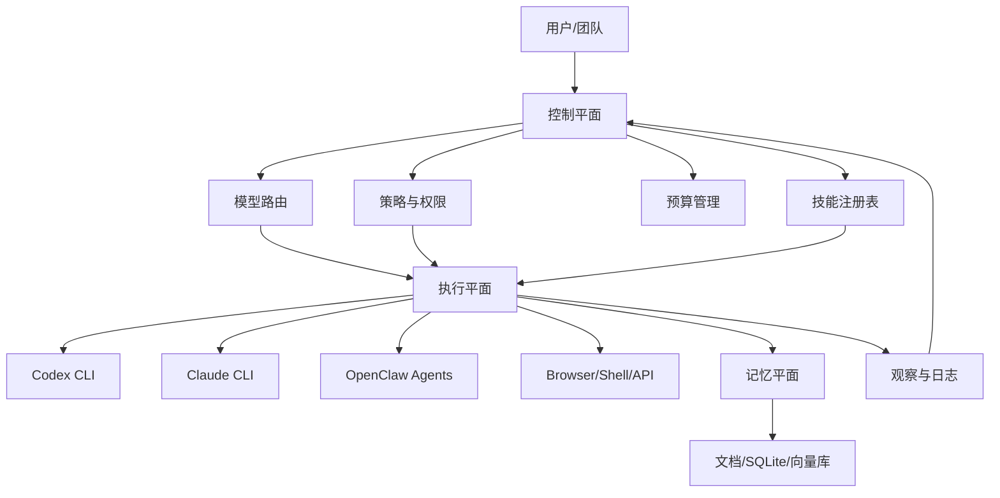

# OpenClaw、Node.js 与超级大脑架构

这篇回答四个问题：

1. 为什么很多 OpenClaw 类系统会偏向 Node.js。
2. 有没有比 Node.js 更合适的选择。
3. Markdown 作为中间层为什么好看但不够快。
4. 如果要做一个超越 OpenClaw 和 Hermes 的“超级大脑”，系统应该怎么设计。

先说结论：**最好的方案通常不是单一语言或单一格式，而是分层、分工、分运行时的混合系统。**

## 为什么很多系统会选 Node.js

Node.js 不是唯一正确答案，但它很适合做控制层和协同层。

| 原因 | 说明 |
| --- | --- |
| 异步 I/O 强 | 适合消息、文件、网络和 CLI 调度 |
| 生态丰富 | Web、桌面、API、工具链都很成熟 |
| 跨平台好 | Windows、macOS、Linux 都能跑 |
| 和前端天然连通 | UI、文档、浏览器自动化容易衔接 |
| JSON/Markdown 友好 | 适合人读、日志和任务流 |

### 但它也不是万能

- CPU 密集型任务不理想。
- 高并发调度不是它唯一优势。
- 复杂数值计算和底层控制未必最优。
- 过度依赖 JS 生态时，系统容易变得松散。

## 有没有更好的选择

有，但“更好”取决于你要做什么。

| 语言 / 运行时 | 优势 | 不足 | 适合放哪层 |
| --- | --- | --- | --- |
| Node.js / TypeScript | 调度、UI、I/O、生态、快速迭代 | CPU 任务不强 | 控制层、编排层 |
| Python | AI、数据、模型、科学计算 | 分发和部署有时较重 | 研究层、模型层 |
| Go | 并发、单文件部署、服务稳定 | 生态不如 JS/Python 广 | 调度服务、worker |
| Rust | 性能、安全、可靠性 | 开发门槛高 | 核心执行层、底层守护进程 |
| Bun / Deno | 快速、现代、TS 友好 | 生态和兼容性仍在演进 | 新型控制层、实验层 |

### 最稳妥的答案

不要只问“哪个语言最好”，而要问：

```text
控制层用什么？
执行层用什么？
模型层用什么？
日志与状态层用什么？
```

这比单语言主义更接近真正的系统设计。

## Markdown 很清楚，但不够快

Markdown 的价值在于：

- 人能直接看。
- Git diff 很友好。
- 适合审阅、复盘、发布。
- 适合把任务写成文档。

它的问题在于：

- 写得越细，越像静态文档。
- 任务状态变化时，更新频率会变慢。
- 很难承载高频事件流。
- 不适合把每个步骤都当成实时消息总线。

## 更高效的中间层

如果要更高效，建议采用“流式中间层 + 文档快照”的混合方案。

| 格式 / 层 | 优点 | 缺点 | 适用 |
| --- | --- | --- | --- |
| Markdown | 可读、可审、可发布 | 更新不够实时 | 说明、复盘、输出 |
| JSON / YAML | 结构清楚 | 人读不够舒服 | 配置、任务卡、manifest |
| JSONL / Event Log | 适合流式写入和回放 | 不适合直接阅读 | 事件、运行轨迹 |
| SQLite | 查询快、状态清楚 | 人不直观 | 本地状态、索引、缓存 |
| Message Bus | 实时、解耦 | 复杂度高 | 多 agent 协同 |
| Protobuf / MsgPack | 高效、紧凑 | 不适合手工维护 | 高性能中间层 |

### 推荐组合

```text
Markdown = 人类界面
JSONL = 运行事件
SQLite = 状态索引
Message Bus = 协同通道
```

这比“全 Markdown”更快，也比“全事件流”更可审。

## 为什么全 Markdown 会拖慢系统

Markdown 很适合做书、说明、复盘和任务卡，但不适合承担每秒多次变化的运行状态。一个 agent 系统真正运行起来时，会产生大量细碎事件：

- 任务被创建。
- agent 开始认领。
- 工具调用开始。
- 工具调用返回。
- 预算被消耗。
- 中间结果被缓存。
- 复核发现风险。
- 人工审批通过或拒绝。
- 最终结果写回。

这些事件如果全部写进 Markdown，会出现三个问题：

1. 文件 diff 很快变得嘈杂。
2. 多个 agent 同时写同一个文件时容易冲突。
3. 查询“最近 30 分钟失败的任务”这类问题会很慢。

更合理的做法是：事件先进 JSONL 或消息总线，当前状态落 SQLite，最终结论再生成 Markdown。这样人看到的是清晰文档，机器跑的是高效状态。

## 一个更强的架构：超级大脑

如果要做一个超越 OpenClaw 和 Hermes 的系统，核心不是更像聊天框，而是更像一个**认知操作系统**。

### 你可以把它看成五层

1. **控制平面**：负责任务分发、权限、预算和路由。
2. **执行平面**：负责 CLI、浏览器、文件、API 和桌面动作。
3. **记忆平面**：负责短期、长期、项目和组织记忆。
4. **策略平面**：负责模型选择、成本控制和安全闸门。
5. **协作平面**：负责多个 agent、多人和多工具协同。

### 结构示意



## 超级大脑 v0.1 模块清单

| 模块 | 作用 | 最小实现 | 进阶实现 |
| --- | --- | --- | --- |
| Task Kernel | 统一任务生命周期 | YAML/JSON 任务卡 | 状态机 + 任务锁 + 重试队列 |
| Agent Registry | 登记 agent 能力和限制 | 一个 registry.json | 动态能力发现、健康检查、版本控制 |
| Skill Registry | 管理技能包 | manifest + examples | 测试样例、权限声明、回滚策略 |
| Model Router | 选择模型和 CLI | 手工配置 | 按成本、延迟、质量和隐私自动路由 |
| Memory Router | 决定写入什么记忆 | Markdown/SQLite | 分层记忆、证据链、遗忘策略 |
| Event Log | 保存运行轨迹 | JSONL | Kafka/NATS/Redis Streams 等消息流 |
| Policy Gate | 权限和风险闸门 | allow/deny 清单 | OPA/Cedar 风格策略、人工审批流 |
| Result Writer | 写回结果 | Markdown/Git | 多目标回写、冲突解决、自动摘要 |
| Observer | 观察系统运行 | 日志文件 | 指标、告警、成本分析、回放调试 |

### 一个事件格式

```json
{
  "event_id": "evt-20260517-001",
  "task_id": "task-20260517-007",
  "actor": "writer-agent",
  "type": "draft.updated",
  "status": "ok",
  "cost": {
    "tokens": 4200,
    "seconds": 38
  },
  "input_ref": "feishu://book/tasks/007",
  "output_ref": "git://docs/seven-layer-ai-civilization.md",
  "risk": "low",
  "created_at": "2026-05-17T11:50:00+08:00"
}
```

有了这种事件，超级大脑就能回答很多关键问题：谁执行了任务，花了多少成本，写回到哪里，有没有风险，是否需要人工批准，失败后能不能重放。

## OpenClaw 和 Hermes 在这里扮演什么角色

- **OpenClaw** 更像执行工作台和入口层。
- **Hermes** 更像记忆基础设施。
- **超级大脑** 则是把执行、记忆、预算、权限、协同和回写放到一个统一认知框架里。

换句话说：

```text
OpenClaw = 手脚
Hermes = 记忆
超级大脑 = 调度 + 预算 + 协调 + 反思
```

## CLI 为什么会变重要

Codex CLI、Claude CLI 这类工具越来越强，说明未来很可能不是“一个网页里包住一切”，而是“多个高能力执行体围绕一个控制层协作”。

### 它们的价值

- 适合直接跑任务。
- 适合自动化工作流。
- 适合与 shell、Git、测试、浏览器协作。
- 适合在本地环境中快速执行。

### 也要小心

- 不同 CLI 的输出格式不同。
- 能力不同，不代表边界一致。
- 需要统一任务卡和回写规则。

## 超级大脑的核心原则

### 1. 事件驱动

所有重要动作都应该变成事件，而不是隐式状态。

### 2. 预算可见

每个任务要知道消耗了多少模型、多少时间、多少轮次。

### 3. 权限前置

先决定允许什么，再决定怎么做。

### 4. 人工可插拔

高风险节点必须能插入人工。

### 5. 结果可回写

所有任务最后都要回到可审阅的文档或状态库。

### 6. 多运行时协作

不要让一个运行时做所有事。控制层、执行层、记忆层分开更稳。

## 一个更现实的落地路线

### 第一阶段：控制层先行

- 用 Node.js / TypeScript 做调度器。
- 用 Markdown 做任务卡。
- 用云文档或 Git 做回写。
- 先连接少数 CLI 和 OpenClaw agent。

### 第二阶段：事件流加入

- 用 JSONL 记录事件。
- 用 SQLite 做状态索引。
- 用消息总线做通知和解耦。
- 引入统一 skill 注册表。

### 第三阶段：多运行时协同

- Python 负责数据和模型工作。
- Go / Rust 负责稳定服务和本地守护进程。
- Node.js 保持编排和界面。
- CLI 工具作为可替换执行器。

### 第四阶段：自我优化

等前三阶段稳定后，再让系统开始自我优化：

- 统计哪些任务最常失败。
- 统计哪些 agent 最适合哪类任务。
- 统计哪些 skill 包复用率最高。
- 根据预算和质量自动推荐模型。
- 把失败案例写回训练样例和复核清单。

这一阶段要非常谨慎。自我优化不是让系统随意改自己，而是让系统提出改进候选，由人或高权限策略批准。真正强大的超级大脑不是“没有人管”，而是“能把需要人管的地方准确指出来”。

## 这套架构真正强在哪里

- 它不是单点助手，而是统一认知系统。
- 它不是只会回答，而是能分发、执行、回写和复盘。
- 它不是单一模型，而是多模型、多 CLI、多 agent 的协作层。
- 它不是只追能力上限，而是把能力、预算、权限和审计放在一起。

## 这套架构真正难在哪里

- 协调比单体更难。
- 状态同步比单次生成更难。
- 权限设计比调用模型更难。
- 一旦做大，治理比能力更重要。

## 结论

如果你要做的是今天就能跑的系统，Node.js 依然是很好的控制层选择。

如果你要做的是更高效、更精明、更强大的系统，答案不是“再换一个语言”这么简单，而是：

```text
把 Markdown 变成可读层，
把事件流变成运行层，
把 CLI 和 agent 变成执行层，
把记忆和预算变成控制层，
把人保留在最终闸门上。
```

这才更像一个真正的超级大脑。
